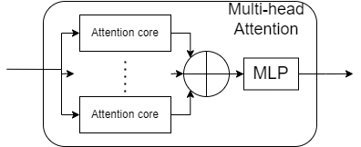

# Tiny_LeViT_Hardware_Accelerator
 This is my hobby project by using System Verilog. I worked on this project continuously for about 4-5 weeks, only dedicating evenings and weekends to it. I wrote approximately 2000+ lines of SV design code and 1900+ testbench code in total. It will cost 97000+ LUT and 51000+ FF in FPGA implementation(Vivado).
 
 This work is based on [LeViT: a Vision Transformer in ConvNet’s Clothing for Faster Inference](https://github.com/facebookresearch/LeViT).

 But I've simplified the original large network into a smaller one, so I call it **Tiny_LeViT**.

 All design file are in ```src``` folder and testbench in ```sim``` folder, include:
 Completed: 1) finishied Tiny LeViT Hardware Accelerator. 2)finished Convolutional layer and Attention layer. 3) finished Tanh function and divider module. 4) finished Average pooling module.

 Of course, due to the complexity of hardware accelerators and network functions, many problems arise during the simplification process, some of which are yet to be resolved or will be addressed in the future.

 Problem: 1) It not support float-point number and arithmetic operation. 2) It not support multi-channel. 3) It can be synthesized but I didn't verify the post-synthesize timing simulation. 4) It has wrong connection in multi-head block because I don't understand multi-head attention when I make it. 5) Divider is not good and some module will have overflow problem.

 Anyway, if you have questions or improvements, just tell me. Thanks!

## Network Architecture
- ```src/Tiny_LeViT_top.sv``` is the top level of Tiny_LeViT. It contain three convolutional layer(16,8,4), four stage1(2-head attention and MLP) and stage2(4-head attention and MLP). In the end, it has e average pooling module.
- Define every parameter in ```src/definition.sv```.
- Input number is 8-bit, but it will change in later module.
- Most of module have two signals or flags: ```end``` which indicate output result and ```en``` which enable the module. 


### DFF2
- This is synchronizer which have two D flip-flop.


### Enable
- This module can generate enable signal accroding to last module's end signal and their own end signal. It seems like handshake.

## Convolutional layer
- Use row stationary (RS) to get max parallel computing. Every PE can compting 1D row convolution, all PEs can parallel in same time.
- ```src/Conv_core_sa.sv``` and ```src/PE_ROW_SystolicArry.sv``` is normal version of convolution layer which delay is only 3 cycle from input data to first output data.
- Other convolutional core aim to accelerate the convolutional layer when stride=2 and padding=1. Delay: ```src/Conv16_core.sv```: 10 cycle, ```src/Conv8_core.sv```: 6 cycle,```src/Conv4_core.sv```: 4 cycle.


### PE_ROW
- Use 1D Systolic array to do 1D convolution. Use FSM to control the data flow.


#### PE_MAC 
- The basic PE which can only support multiply and accumulate operation.


## Stage
- Stage module contain 2-head attention or 4-head attention and then 2 MLP layer.


## Multi-head(2/4) Attention layer
- ```src/Stage_2head.sv``` have 2 attention core and 1 MLP.
- ```src/Stage_4head.sv``` have 4 attention core and 1 MLP.



### Attention_core
- For attention layer, use Tanh instead of softmax and use ReLU instead of Hardswish to simplify that difficulty of hardware calculation.
- Tanh function is a complex module in this core.
- We need buffer to store the data and do matrix multiplicayion.


### PE_2D
- Use 2D Systolic array to do 2D matrix multiplication.


### Tanh
- formula of tanh is $\frac{e^x-e^(-x)}{e^x+e^(-x)}$.
- This module contain two Exp module and 1 divider.


#### Divider
- Divider is a basic module which is combinational logic.
- ```i_up``` and ```i_bo``` indicate the two input(up and down).
- ```cout``` is the result and ```rem``` is remainder.

#### Exp
- In order to calculate the exponential function, we use the expansion to approximate the fourth order.
- The formula is $exp(x)=1+x(1+\frac{x}{2} (1+\frac{x}{3}(1+\frac{x}{4})))$.
- This module also use 1 divider.


## MLP
- MLP layer only use 1x1 convolution, so it is very easy. You can extend it to multi channel in the future.

## Average Pooling
- Now, it can only support caculate value's average number, not a real pooling.

